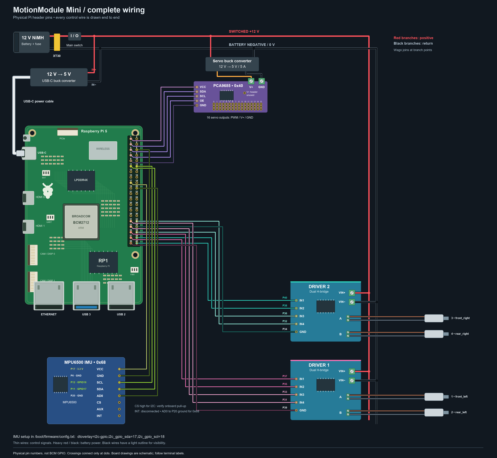

# MotionModule Mini

Mini has **4 motor outputs on 2 dual H-bridge boards**, **16 servo outputs on
one PCA9685**, and the same Pi-connected **MPU6500 IMU** as the full module.
It runs the same shared runtime, robot API, watchdog, dashboard and Driver Station.
Only the hardware profile and build references differ.

- [Mini bill of materials](BOM.md)
- [Mini pinout](PINOUT.md)
- [Hardware definition](hardware.py)
- [Four-wheel Mecanum sample](../examples/MecanumMini)
- [Full MotionModule](../MotionModule/README.md)



## Install and try

On an installed Pi:

```bash
motionmodule install testing --variant mini
```

From a repository checkout on a fresh Pi:

```bash
bash install.sh --version testing --variant mini
```

The installer starts the MecanumMini sample for a Mini install. The sample's
robot, autonomous, sensor and dashboard code is identical to the full Mecanum
sample; its hardware definition includes only wheel channels 1–4. Existing
robot folders are kept. For custom code, copy the Mini hardware definition into
your robot folder, retain channels 1–4 and rename outputs for your mechanisms.
Motor direction is changed with `inverted`, never by moving pins.

The installed Mini limit persists across updates and project changes. A robot
map containing channels 5–8 is rejected before GPIO is opened. Debug and the
motor activity display show four outputs; servo and IMU behavior stays the same.

To run the simulated Mini dashboard on Windows:

```powershell
$env:MOTIONMODULE_VARIANT = "mini"
python -m motion_module.demo --no-browser
```

On Linux/macOS:

```bash
MOTIONMODULE_VARIANT=mini python -m motion_module.demo --no-browser
```

## Switching builds

Updates shows both the installed module and its main/testing branch. Choose
MotionModule or MotionModule Mini, then install the desired branch. A module
change selects that module's Mecanum sample, preserves previous project folders,
and reboots using the selected hardware limit. The current Mini implementation
is on testing; main gains it only after review and merge.

The full module's enclosure STEP model and 22-M3-screw count describe the full
assembly. Mini-specific enclosure CAD and its final mounting screw total have
not been supplied. The Mini wiring diagram is a schematic, not enclosure CAD.
