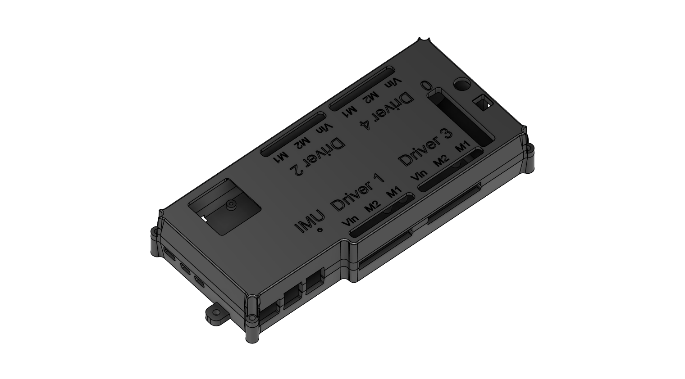

# Reference-build CAD

These STEP models come from the owner's personal Mecanum testing robot.

| File | Assembly |
| --- | --- |
| [motion-module.step](motion-module.step) | Motion-module controller enclosure and mounting assembly for the Pi, four dual motor drivers and PCA9685 servo board |
| [electronics-box.step](electronics-box.step) | Electronics/battery box with a battery-and-switch section and a hollow power-wiring compartment |

The electronics box works with the REV Slim and goBILDA 12 V NiMH batteries
listed in the [bill of materials](../BOM.md). The battery section includes the
rocker switch and outgoing battery lead. The hollow section holds your 12 V
wiring; the reference robot hides its buck converters and motor-driver power
distribution inside it for cleaner wiring.

Import the `.step` files into a CAD application to inspect the assemblies and
prepare individual parts for manufacture. These are the supplied STEP models;
no STL files or print settings are included.

For the motion-module assembly, use **four M2.3 × 5 mm self-tapping screws**
to mount the Raspberry Pi. Use **22 M3 × 5 mm self-tapping screws in total**
for all four motor-driver boards, the PCA9685 servo board, the IMU and the
enclosure. This total includes **four corner screws**, one at each corner,
to fasten the top plate to the bottom plate; the remaining screws mount the
boards, one per mounting hole. See the [mounting screw table](../BOM.md#motion-module-mounting-screws).

See the [installed photos and wiring diagram](../README.md#wiring-at-a-glance).
The open-controller photo predates plugging in the IMU; the current build and
sample code use a Pi-connected MPU6500. Enclosure labels identify connectors;
the [pinout guide](../docs/PINOUT.md) defines the locked electrical wiring.
