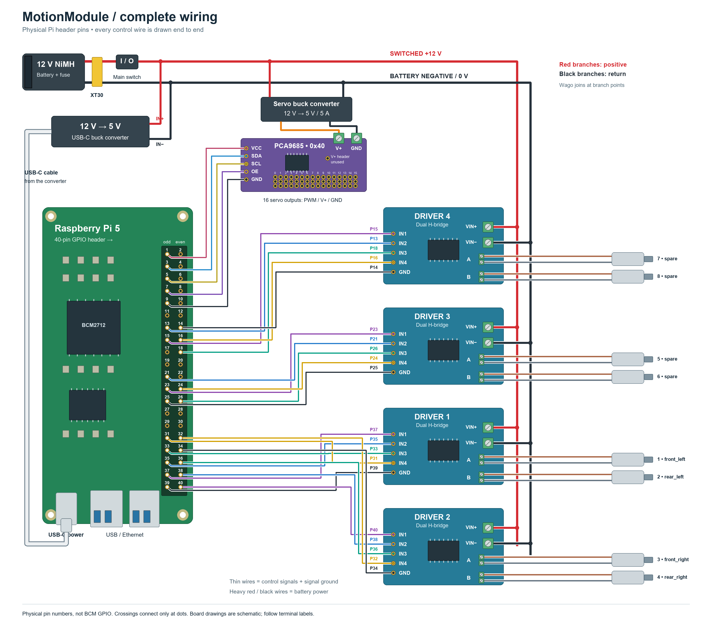

# MotionModule pinout and power wiring

Software uses **BCM GPIO numbers**. Connector diagrams use **physical header
numbers**. Every table below shows both; never assume they are interchangeable.
Use this wiring guide together with the root-level [bill of materials](../BOM.md).
Both are built into **Debug → Wiring** and **Debug → Parts** in the robot
dashboard, so the guide works on the robot hotspot without internet access.
The dashboard uses the active configuration's names and pins; the tables here
describe the reference harness.

> [!IMPORTANT]
> **This wiring is locked.** The reference robot is wired exactly as these
> tables show, and that wiring works. The built-in `hardware.py`, the Mecanum
> sample, the dashboard's wiring guide and `motionmodule pinout` all use it, on
> `main` and on `testing`, and no change may move a pin, driver or ground.
> [AGENTS.md](../AGENTS.md) explains, and `tests/test_wiring_lock.py` fails if
> any of it changes. A robot wired another way keeps its own `hardware.py`.

## Read the connector before connecting a wire

The Pi has **40 physical header pins**, with two numbering systems:

- **Physical pin** is the numbered position on the connector, from 1 to 40.
- **GPIO / BCM** is the signal number used in `hardware.py`. For example,
  GPIO12 is **physical pin 32**, not physical pin 12.

In Debug, select a header pin to see its destination and purpose. A motor
signal label means a wire to an H-bridge input, not a connection directly to
the motor. The motor's two heavy wires go to that driver's output pair.
Confirm pin 1 using the Pi/header markings; a diagram can be rotated relative
to the board on your bench.

The dashboard draws the Pi 5 the way it sits on the reference controller
plate: USB and Ethernet ports at the bottom, the 40-pin header down the right
edge. Held that way, pin 1 is the top pin of the row nearer the middle of the
board and pin 2 sits beside it on the board edge. Odd pins run down the inner
row and even pins down the outer row, exactly as the pin list beside the
drawing reads.

## Four dual H-bridge boards

Each GODIYMODULES board controls two motors. Its control header reads
`IN1 IN2 IN3 IN4 GND`: **IN1 and IN2 drive the board's MOTOR_A terminal
(output A), and IN3 and IN4 drive MOTOR_B (output B).** So `1A` is Driver 1's
MOTOR_A, wired from IN1 and IN2, and `1B` is Driver 1's MOTOR_B, wired from IN3
and IN4; drivers 2, 3 and 4 follow the same pattern. The inputs accept 3-18 V,
so the Pi's 3.3 V signals drive them directly. VIN+ and VIN- take the 12 V
battery, and GND joins the Pi's ground as the signal reference. Connect each
motor only to its own terminal pair.

Two inputs drive one motor:

| First input (IN1 or IN3) | Second input (IN2 or IN4) | Motor |
| --- | --- | --- |
| Speed signal (PWM) | Off | Forward |
| Off | Speed signal (PWM) | Reverse |
| Off | Off | Stopped (coasts) |

Which way counts as forward depends on how the motor's two wires sit in the
terminal. Set `inverted` in `hardware.py` rather than swapping wires.

| Driver | Output | Motor channel | Default code name | Forward wire | Reverse wire | Pi ground |
| ---: | :---: | ---: | --- | --- | --- | --- |
| 1 | A | 1 | `driver_1a` | IN1 · physical 37 / GPIO26 | IN2 · physical 35 / GPIO19 | physical 39 |
| 1 | B | 2 | `driver_1b` | IN3 · physical 33 / GPIO13 | IN4 · physical 31 / GPIO6 | physical 39 |
| 2 | A | 3 | `driver_2a` | IN1 · physical 40 / GPIO21 | IN2 · physical 38 / GPIO20 | physical 34 |
| 2 | B | 4 | `driver_2b` | IN3 · physical 36 / GPIO16 | IN4 · physical 32 / GPIO12 | physical 34 |
| 3 | A | 5 | `driver_3a` | IN1 · physical 23 / GPIO11 | IN2 · physical 21 / GPIO9 | physical 25 |
| 3 | B | 6 | `driver_3b` | IN3 · physical 26 / GPIO7 | IN4 · physical 24 / GPIO8 | physical 25 |
| 4 | A | 7 | `driver_4a` | IN1 · physical 15 / GPIO22 | IN2 · physical 13 / GPIO27 | physical 14 |
| 4 | B | 8 | `driver_4b` | IN3 · physical 18 / GPIO24 | IN4 · physical 16 / GPIO23 | physical 14 |

**Where each driver sits.** On the reference controller plate, with the Pi on
the left and its USB ports at the bottom, Driver 1 sits beside the USB ports,
Driver 2 above it, Driver 3 to the right of Driver 1 and Driver 4 above
Driver 3. That is the wiring the project's Mecanum sample expects, with its
wheels on Drivers 1 and 2. Wire the same way to run the sample unchanged, or
change the pins in `hardware.py` to match your own wiring.

The default name is the driver position, so no lookup is needed to find the
wire. Rename any of them in `hardware.py` and the dashboard follows: the
Mecanum sample renames channels 1-4 to `front_left`, `rear_left`,
`front_right` and `rear_right`.

**Each driver is one short bundle of wires.** Its four signal pins and its
ground sit in a single run of header positions, so you wire a driver without
tracing across the board:

| Driver | Signal pins | Ground | Shape |
| ---: | --- | ---: | --- |
| 1 | 31, 33, 35, 37 | 39 | Five in a row down the left column |
| 2 | 32, 36, 38, 40 | 34 | Five in a row down the right column |
| 3 | 21, 23 and 24, 26 | 25 | Facing pairs, ground between them |
| 4 | 13, 15 and 16, 18 | 14 | Facing pairs, ground between them |

Drivers 1 and 2 face each other across the bottom of the connector. Every
motor's two inputs are neighbouring positions on the same side, except
Driver 2's output B, whose inputs sit either side of that driver's own ground
at physical 34.

Seven GPIOs stay free for later use: physical 8, 10, 11, 12, 19, 22 and 29.
That includes the whole default UART pair (physical 8 and 10), so the GPIO
serial console still works. Physical 7 (GPIO4) carries the servo board's OE
wire.

This direct-GPIO profile intentionally supports four dual drivers/eight motors.
Adding still more direct H-bridges would consume pins reserved for other Pi
interfaces and increase boot-state/PWM complexity. Expand servos freely by I2C;
for more than eight brushed motors, add an addressed motor-control/PWM expansion
board and a new software backend instead of casually taking the ID or UART pins.

GPIO7/8/9/11 normally have alternate SPI functions. The reference Raspberry Pi
OS image has SPI disabled. `motionmodule doctor` warns if a `/dev/spidev*`
device is active; disable SPI before using Drivers 3 and 4.

Raspberry Pi GPIOs are inputs during early boot, so they cannot be relied on to
hold a driver input low until Linux and the MotionModule service have started.
Keep motor power physically switched off through boot and watch that every
output stays still before you trust it. If a particular driver does twitch at
boot, a 10 kΩ pull-down from that input to signal ground holds it low.

## PCA9685 servo controller

The servo board is a separate I2C device and shares no motor GPIO. Its 16
servo outputs live **on the PCA9685 board**, not on 16 Pi pins. Five Pi wires
run to it, and they sit in one unbroken run down the top of the left column —
pins 1, 3, 5, 7, 9 — so the whole board is a single bundle. Pins 8 and 10 are
left free for the serial console.

| PCA9685 connection | Raspberry Pi / supply connection | What it is for |
| --- | --- | --- |
| VCC (logic) | physical pin 1 / 3.3 V | Powers the chip only, about 10 mA |
| SDA | physical pin 3 / GPIO2 | Commands, and the answer that proves the board is present |
| SCL | physical pin 5 / GPIO3 | Clocks that data |
| OE | physical pin 7 / GPIO4 | Enables and disables all 16 outputs |
| GND | physical pin 9 / ground | Reference for SDA, SCL and OE |
| V+ screw terminal | separate regulated servo supply positive | The only supply that moves servos |
| V+ screw terminal GND | servo supply negative and common logic ground | Returns servo current to its own supply |
| **V+ header pin** | **nothing** | Same copper as the screw terminal — see below |

### OE, the output enable pin

OE is active low. MotionModule holds it low so the outputs are enabled, and
drives it high to cut all sixteen at once. Because OE is a wire and not an I2C
register, that cut still works if the bus has stopped answering.

The board pulls OE low by itself, so the outputs are enabled any time the Pi is
not driving that pin — including through boot, before Linux claims GPIO4. That
is safe, because the PCA9685 powers up with every channel off, but it does mean
**OE is an enable line, not a power cutoff.** Keep the physical cutoff.

Set `servos.output_enable_gpio` in `hardware.py` to move it, or to `None` if you
leave OE unconnected. From robot code:

```python
module.set_servo_outputs_enabled(False)   # cut all 16 outputs at the board
module.set_servo_outputs_enabled(True)    # allow them again
module.servo_outputs_enabled              # what the pin is doing right now
```

### Do not wire the V+ header pin to the Pi

The V+ header pin and the two-screw power terminal are the same net on this
board — Adafruit's own guide says you can "inject power from the 2-pin terminal
block", meaning the pin already carries whatever the terminal is fed. It exists
to pass that rail to a second board.

So if the servo rail is on the terminal and you also run the V+ header pin to a
Pi 5 V pin, you have connected the servo supply directly to the Pi's 5 V rail.
With a 12 V rail on that terminal, 12 V lands on the Pi. Leave it disconnected.

Adafruit rates the board itself for up to 12 V on V+ ("you should provide
5-6VDC if you are using servos … if you have to, you can go higher to 12VDC"),
but that voltage reaches the middle contact of all sixteen outputs, so every
servo plugged in sees it. Hobby servos want 5–6 V and an Axon Mini MK2 tops out
at 8.4 V. Feed V+ the stepped-down rail, not the battery.

### The 16 servo output headers

Each numbered output has **three contacts**. Follow the board's printed
signal/V+/GND labels and the servo's connector specification, rather than
assuming wire colors or board orientation:

| Contact on each output | Connect to | What it does |
| --- | --- | --- |
| Signal / PWM | That servo's signal wire | Carries the command for this one channel |
| V+ | That servo's power wire | Shared regulated servo supply, not Pi logic power |
| GND | That servo's ground wire | Returns power to the servo supply |

The first board has these default code names. They match the channel numbers
printed on the board, so `servo_5` is the output labelled 5. Rename them in
`hardware.py` to match your mechanisms. A configured name does not prove a
servo is plugged in.

| Board output | Default code name | Board output | Default code name |
| ---: | --- | ---: | --- |
| 0 | `servo_0` | 8 | `servo_8` |
| 1 | `servo_1` | 9 | `servo_9` |
| 2 | `servo_2` | 10 | `servo_10` |
| 3 | `servo_3` | 11 | `servo_11` |
| 4 | `servo_4` | 12 | `servo_12` |
| 5 | `servo_5` | 13 | `servo_13` |
| 6 | `servo_6` | 14 | `servo_14` |
| 7 | `servo_7` | 15 | `servo_15` |

### Other connectors and pads

- **OE (output enable):** low enables the PWM outputs, high disables them.
  It is wired to physical pin 7 / GPIO4, as described under
  [OE, the output enable pin](#oe-the-output-enable-pin).
  Disabling PWM does not disconnect the servo power rail.
- **A0–A5:** solder address pads, not servo outputs. They choose which I2C
  address this board responds to.
- **Repeated side headers:** repeated SDA/SCL/VCC/GND labels are the same
  electrical connections for chaining another controller. They do not each
  need a separate Pi pin. V+ remains the separate servo power rail.

The [PCA9685 datasheet](https://www.nxp.com/docs/en/data-sheet/PCA9685.pdf)
documents OE and address inputs. The
[PCA9685 connector reference](https://learn.adafruit.com/16-channel-pwm-servo-driver/pinouts)
explains the common breakout layout; match labels on the selected AITRIP board
before wiring, since board orientation and fitted components can differ.

> [!WARNING]
> `VCC` powers PCA9685 logic. `V+` powers the servos. Do not bridge them and do
> not power a bank of servos from a Raspberry Pi 5 V header pin.

The first board has every address pad open and uses `0x40`. To add another
board, solder A0 on the second board for `0x41`, chain SDA/SCL/VCC/GND, provide
appropriately sized servo power, and edit:

```python
# In HARDWARE["servos"] in hardware.py:
"addresses": [0x40, 0x41],
```

Code then uses `module.servo(channel=0, board=1)` for the second board. Never
put two boards with the same address on one bus. The hardware can address many
boards, but wire length, bus capacitance, connector current, and power
distribution become the practical limits well before the advertised maximum.

If `servos.channels` contains an explicit list of named outputs, also add names
with `"board": 1` and channels 0–15 for the second board. If you omit that
optional dictionary, MotionModule automatically names every output on every
configured board. Debug always shows all 16 physical headers per board, even
when only some have explicit names.

## Reserved and unused Pi header pins

"Reserved" means kept for a specific electrical interface. It does not mean
that a sensor is connected. The base harness leaves the following spare pins
available; the optional IMU extension below uses pins 6, 11, 12, 17 and 20.

| Physical pin(s) | Reference purpose | What to do |
| --- | --- | --- |
| 1, 3, 5, 7, 9 | PCA9685 logic: VCC, SDA, SCL, OE, GND | Connect the five logic wires above; GPIO2/3 stay reserved for I2C even if servo support is disabled |
| 8 / GPIO14, 10 / GPIO15 | UART transmit and receive | Leave disconnected in the default harness; serial access may use them |
| 27 / GPIO0, 28 / GPIO1 | HAT ID EEPROM data and clock | Leave disconnected; MotionModule rejects motor use of these pins |
| 2, 4 | Pi 5 V power | Not used by the reference harness; never connect the motor battery or servo V+ here |
| 17 | Spare Pi 3.3 V logic power | Unused; not a motor or servo supply |
| 6, 20, 30 | Spare Pi ground | Available for low-current signal references |
| 11, 12, 19, 22, 29 | Unassigned GPIO17/18/10/25/5 | No configured device or sensor; alternate interfaces may use these pins |

If you customize motor pins, Debug shows the **active assignment** in place of
the reference label. For example, using a UART GPIO for a motor requires
disabling its serial-console/UART use first. Do not treat an unused label as a
guarantee that another Pi service is not using that pin.

## Optional GY-BNO055 nine-axis IMU

The [selected Teyleten Robot board](https://www.amazon.com/dp/B0D47G672B)
has eight header pins. Match the labels shown on its underside; numbering
below follows VIN through REST and is not Pi header numbering.
This extension leaves every motor and PCA9685 wire in place.

| Board header | Connection / purpose |
| --- | --- |
| 1 · VIN | Pi pin 17, 3.3 V |
| 2 · GND | Pi pin 20, ground |
| 3 · SCL–Rx | Pi pin 12, GPIO18, software I2C clock |
| 4 · SDA–Tx | Pi pin 11, GPIO17, software I2C data |
| 5 · AD0 | Pi pin 6, ground, selects address 0x28 |
| 6 · INT | Leave disconnected; the driver polls the sensor |
| 7 · BOOT | No Pi GPIO; retain pull-up for normal boot, never ground for I2C |
| 8 · REST | No Pi GPIO; active-low reset, retain pull-up; driver uses software reset |

Use a 10 kΩ pull-up to 3.3 V if BOOT or REST lacks one on the board.
SDA/SCL also require pull-ups to 3.3 V. Standard I2C requires PS0 and PS1 low;
verify the board's mode-selection pads before soldering. BOOT is not PS0/PS1.
See the [Bosch datasheet](https://www.bosch-sensortec.com/media/boschsensortec/downloads/datasheets/bst-bno055-ds000.pdf).

With power off, wire the board, then add under `[all]` in
`/boot/firmware/config.txt` (older Pi OS: `/boot/config.txt`) and reboot:

```ini
dtoverlay=i2c-gpio,i2c_gpio_sda=17,i2c_gpio_scl=18
```

Debug → Wiring shows the optional connections even before hardware is present.
Checks & logs verifies the BNO055 chip ID on the independent bus, below the
PCA9685 checks. Detection is not proof of calibration or usable heading.
[LocalIMU setup](CODING.md) explains how robot code initializes and reads it.

## Power boundaries

Use three planned power domains:

1. Raspberry Pi logic power from a stable Pi-rated 5 V regulator.
2. Motor power from the robot battery through a main switch and correctly sized
   fuses to each driver branch.
3. Servo power from a separate regulated rail set for the connected servos,
   normally 5–6 V for standard hobby servos.

Join their negatives at a deliberate common reference point so 3.3 V control
signals have a return path. Do **not** route motor current through a Pi ground
pin: the heavy driver power negatives return directly to the battery/power
distribution bus, while the Pi ground wires are only low-current signal
references.

The Amazon listing's 10 A figure does not override a motor's stall-current
requirement. Measure or obtain each motor's stall current, fuse below the safe
wire/connector/driver limit, and add the recommended heat sinking/airflow for
high continuous current. Use one motor per H-bridge channel.

## First electrical test

1. Disconnect battery and servo power.
2. Verify every BCM/physical pin against the tables with a continuity meter.
3. Verify no motor supply positive is connected to a Pi header pin.
4. Set the servo regulator voltage before attaching servos.
5. Put the chassis on a stable stand with all wheels clear.
6. Power the Pi first with motor power still off, and run
   `motionmodule doctor`.
7. Apply motor power with the physical cutoff in reach.
8. Stop the service and pulse one channel: `motionmodule stop`, then
   `motionmodule test-motor 1`.
9. Test each channel and label the resulting physical wheel/mechanism.
10. Restart normal code only after the map is verified: `motionmodule start`.

## A Pi set up before the rewiring

Until 6 September 2026 every pin map MotionModule shipped put the motors on
other pins, `front_left` on GPIO12 and GPIO6, `rear_left` on GPIO19 and GPIO16
and so on, and left the servo board's OE unwired. An install keeps the robot
folders and `~/.config/motionmodule/hardware.py` it finds, so a Pi set up before
then kept that pin map, and its dashboard kept drawing it, after the robot was
rewired to the tables above.

Every install now checks for it. A `hardware.py` whose motors all sit on those
old pins is replaced with the one this release ships: the Mecanum sample's in
`robots/Mecanum`, the built-in one in `~/.config/motionmodule/hardware.py`. The
old file stays beside it as `hardware.py.retired-wiring`, and the install log
says what moved. The new file brings the shipped `inverted` values, so repeat
the first electrical test above and fix `inverted` on any wheel that turns the
wrong way before driving. A `hardware.py` with any other pins is the robot's own and is
never changed.

## Complete wiring diagram


